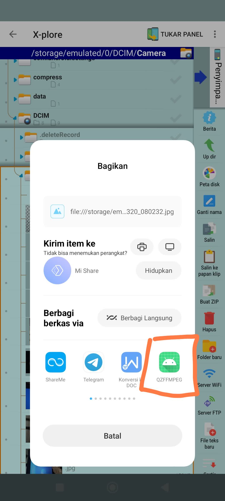

# Termux:ffmpegGUI

Saya asumsikan bahwa anda telah menginstall ffmpeg pada Termux Anda.
1. Pertama - pertama izinkan termux anda untuk membaca Storage penyimpanan File. Dengan menggunakan Perintah 
```termux-setup-storage```

2. Gunakan perintah 
```echo "allow-external-apps=true" >> ~/.termux/termux.properties```
agar mengizinkan aplikasi dari luar atau Aplikasi ini, untuk menjalankan TermuxService.

3. Berikutanya anda bisa menggunakan Aplikasi ini sebagaimana biasanya.

# Tentang Fitur
 Fitur untuk saat ini masih sederhana,
 Aplikasi GUI FFMPEG ini belum saya sempurnakan, Commandline dan PathDirectory (Settingan untuk file output) juga belum bekerja. 
jadi untuk commandline, saya atur sebagai default command untuk Aplikasi GUI ini, walaupun anda mengisi TextBox Commandline dan PathDirectory output file, itu tidak akan bekerja.

1. IntentShared
Anda dapat mengirim foto atau video yang akan hendak dikompress kedalam aplikasi.


atau membuka langsung aplikasi lalu memasukkannya.

2. File Result (Output pengompressan)
Output pengompresan otomatis tersimpan kedalam PathDirectory file aslinya.

3. 

# Support for more features

TrustWallet Address 0x: 0xa1fFcB018e46581f146753aca5Fbf8Faf99161E7

Dana: 082266929573
